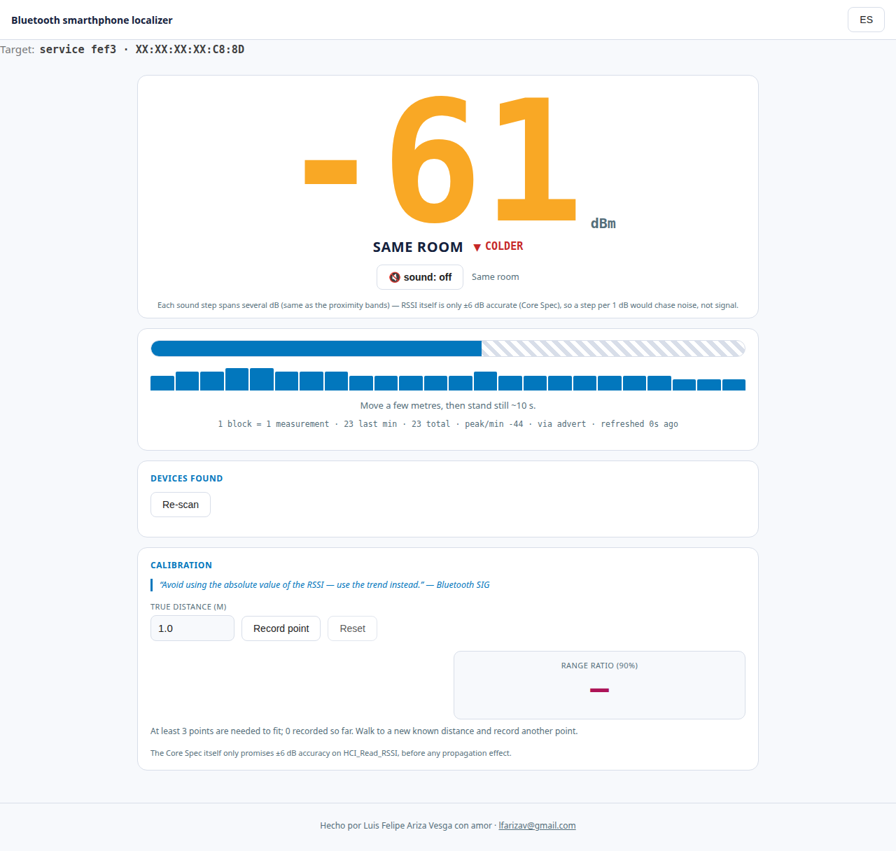

<h1 align="center">Bluetooth smarthphone localizer</h1>
<p align="center"><b>🇬🇧 English below · 🇪🇸 Español más abajo</b></p>

---

## 🇬🇧 English

### The problem

You lost your phone somewhere in the house. It's not ringing, or the ringer
is off. This little tool helps you find it: run it, open a page in your
browser, and walk around — a big number tells you when you're getting
warmer or colder. No app to install on the phone, no GPS, no internet
needed.

<p align="center">
  
</p>

### How to use it

```bash
git clone https://github.com/lfarizav/bluetooth-smarthphone-localizer
cd bluetooth-smarthphone-localizer
python3 -m venv .venv && .venv/bin/pip install -r requirements.txt
.venv/bin/python find_phone.py --find-phone
```

Open the link it prints in your browser, then walk. The number is signal
strength — smaller (closer to 0) is stronger, closer. Watch the word under
it: **warmer** means you're getting close, **colder** means turn around.

**Needs:** a computer with Bluetooth, and the phone's screen recently on
(or currently on) so it's actively broadcasting.

### Please read this

Only use this to find **your own** phone. It works by picking up the
Bluetooth signal any nearby phone happens to be broadcasting — that is not
an invitation to point it at someone else's.

### Want the technical details?

How it actually works under the hood, why it uses Google Fast Pair, and
the design credit for the idea all live in **[docs/TECHNICAL.md](docs/TECHNICAL.md)**,
kept out of this page on purpose.

---

## 🇪🇸 Español

### El problema

Perdiste tu teléfono en algún lugar de la casa. No suena, o el timbre está
apagado. Esta pequeña herramienta te ayuda a encontrarlo: la ejecutas,
abres una página en tu navegador, y caminas — un número grande te dice si
te estás acercando o alejando. No necesita instalar nada en el teléfono,
no usa GPS, no necesita internet.

<p align="center">
  
</p>

### Cómo usarlo

```bash
git clone https://github.com/lfarizav/bluetooth-smarthphone-localizer
cd bluetooth-smarthphone-localizer
python3 -m venv .venv && .venv/bin/pip install -r requirements.txt
.venv/bin/python find_phone.py --find-phone
```

Abre en tu navegador el enlace que imprime, y camina. El número es
intensidad de señal: mientras más pequeño (más cerca de 0), más fuerte,
más cerca. Fíjate en la palabra debajo: **más caliente** significa que te
acercas, **más frío** significa que te alejas.

**Necesita:** un computador con Bluetooth, y que la pantalla del teléfono
haya estado encendida hace poco (o esté encendida ahora), para que esté
anunciándose activamente.

### Por favor lee esto

Úsalo solo para encontrar **tu propio** teléfono. Funciona captando la
señal Bluetooth que cualquier teléfono cercano esté transmitiendo — eso no
es una invitación a apuntarlo hacia el de alguien más.

### ¿Quieres los detalles técnicos?

Cómo funciona por dentro, por qué usa Google Fast Pair, y el crédito de
diseño de la idea original están en **[docs/TECHNICAL.md](docs/TECHNICAL.md)**,
fuera de esta página a propósito.

---

<p align="center">
Hecho por <b>Luis Felipe Ariza Vesga</b> con amor · <a href="mailto:lfarizav@gmail.com">lfarizav@gmail.com</a><br>
Code licensed under <a href="LICENSE">Apache License 2.0</a>.
</p>
